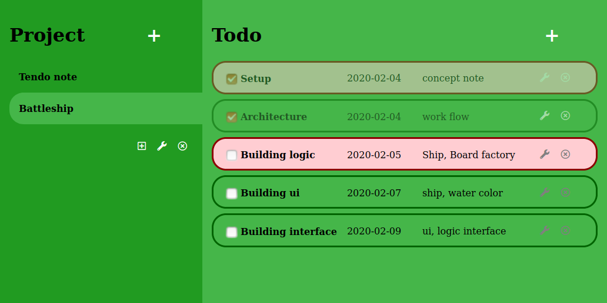

<h1 align="center">Welcome to Tendo Note 👋</h1>

This is a to-do app to have a memo of projects. "Tendo" is Swahili language meaning "To-do".

The main requirement can be found [here](https://www.theodinproject.com/courses/javascript/lessons/todo-list).

+ [beginning concept notes](./docs)
+ screenshot<br />


## Function Description
- Add / Edit / Delete for to-do
- Each to-do is able to collect info about "title", "due-date", "priority", "description"
- priority color
  * light gray: normal task
  * Dark gray: done task
  * light red: urgent priority task

## Technologies
- Javascript: ECMAScript 2018 (es6)
- localStorage
- HTML 5
- CSS 3

## Getting Started

#### execution directory
```
./dist/index.html
```

#### javascript source files
```
./src/
```

## Deployment

### ✨ [Live Demo](https://shjang7.github.io/tendo-note/dist/)

## Contributors

👤 **Suhyeon Jang**

- Github: [@shjang7](https://github.com/shjang7)
- LinkedIn: [@shjang](https://www.linkedin.com/in/shjang/)
- Twitter: [@shjang12](https://twitter.com/shjang12)

👤 **Grace Mugoiri**

- Github: [@mugos](https://github.com/grace-mugoiri)
- LinkedIn: [@grace-mugoiri](https://www.linkedin.com/in/grace-mugoiri-829019134/)
- Twitter: [@GraciaMugoiri](https://twitter.com/GraciaMugoiri)

## 🤝 Contributing

1. Fork it (https://github.com/shjang7/tendo-note/fork)
2. Create your feature branch (git checkout -b feature/[choose-a-name])
3. Commit your changes (git commit -am 'what this commit will fix/add')
4. Push to the branch (git push origin feature/[chosen-name])
5. Create a new Pull Request

## License

This project is licensed under the MIT License - see the [LICENSE](./LICENSE) file for details
